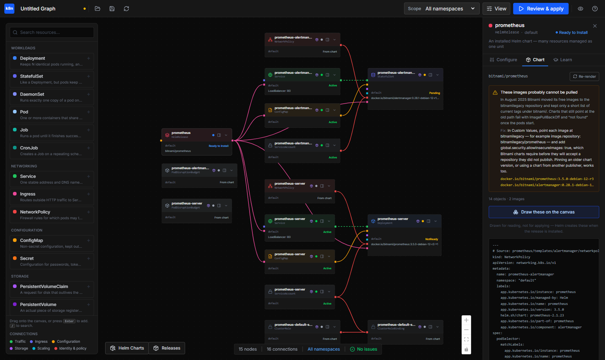
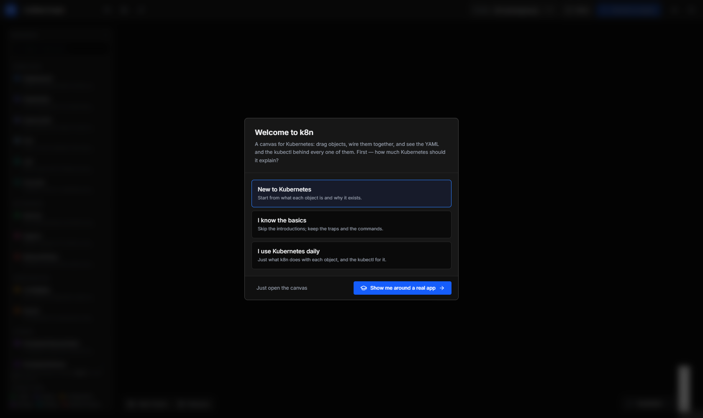
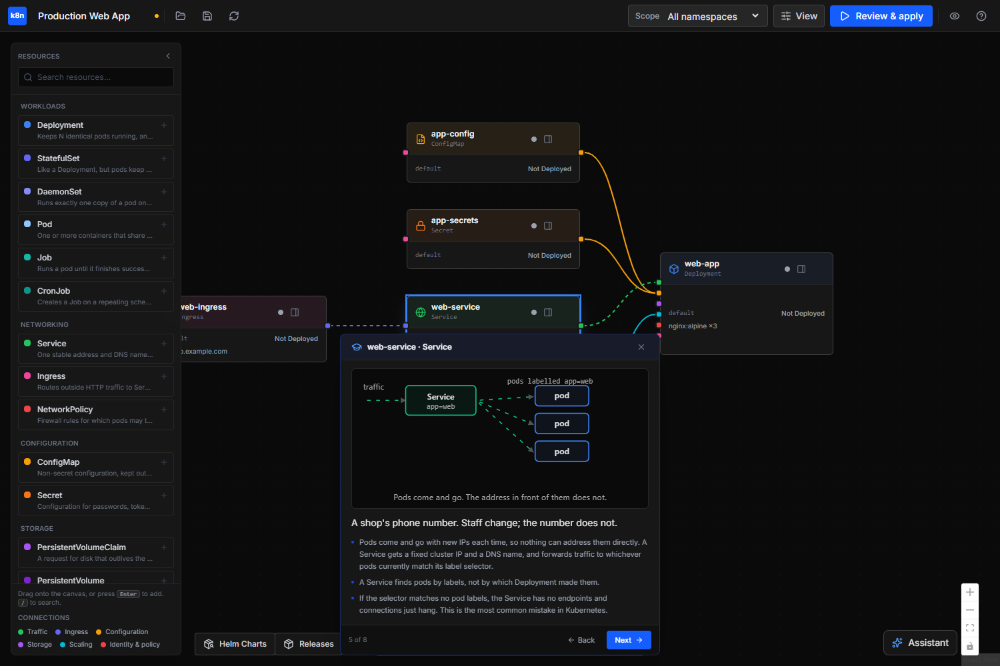
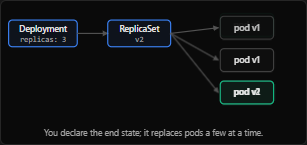

# k8n

A visual Kubernetes IDE that explains itself. Drag resources onto a canvas,
wire them together, and see the YAML — and the `kubectl` — behind every one of
them.

[](LICENSE)



k8n is not a YAML generator with a nice skin. The lines between cards are real:
the whole graph is compiled server-side in one pass, so an edge resolves into an
actual Kubernetes reference rather than a guess.

| Edge | Becomes |
|---|---|
| `Service → workload` | the Service's `selector`, and `targetPort` from the container |
| `Ingress → Service` | the Ingress backend service name and port |
| `ConfigMap`/`Secret` `→ workload` | `envFrom` entries |
| `PersistentVolumeClaim → workload` | a `volume` plus its `volumeMount` |
| `HorizontalPodAutoscaler → workload` | `scaleTargetRef` |
| `ServiceAccount → workload` | `serviceAccountName` |
| `Role`/`ServiceAccount` `→ RoleBinding` | `roleRef` and `subjects` |

Nothing reaches the cluster without a server-side dry run first. Resources
imported from a live cluster are applied as a **partial patch of only the fields
you edited**, so applying an imported Deployment cannot strip probes, volumes or
limits that k8n never modelled.

## Run it

Download the binary for your system from [Releases](../../releases), make it
executable, and run it. It is one file — the UI is inside it. No Node, no
Docker, no database required.

```bash
./k8n-linux-amd64          # macOS: ./k8n-darwin-arm64   Windows: k8n-windows-amd64.exe
```

It prints a link. Open it:

```
  k8n is running on http://127.0.0.1:8080

  Open this link to pair your browser:

    http://127.0.0.1:8080/?t=zx8Q…
```

Or skip the copying entirely — `--open` starts k8n and opens the paired link
for you, which is what a desktop shortcut should point at:

```bash
./k8n --open --port 8090
```

That link carries a pairing token, because every route here can change your
cluster and there is no login. Opening it is the whole setup — k8n saves the
token and takes it back out of the address bar. [SECURITY.md](SECURITY.md)
explains what that does and does not protect.

**On first run** it asks how much Kubernetes you want explained, and offers to
walk you through a working application one object at a time.



### Unsigned binaries

This project has no code-signing certificate.

- **Windows** — SmartScreen says "Windows protected your PC": More info → Run
  anyway.
- **macOS** — `chmod +x k8n-darwin-arm64 && xattr -d com.apple.quarantine k8n-darwin-arm64`,
  or right-click → Open.
- Or build it yourself, below.

## What it does

**It teaches while you work.** Every kind carries an explanation written for
someone who has not memorised Kubernetes: an analogy, what it actually does, the
one idea worth remembering, the mistakes people make, and the `kubectl` you
would otherwise be typing. How much of that you see follows the level you picked
— new, familiar, or expert — and you can change it any time from **View →
Explanations**.



The ideas that are hardest to hold from prose — replacement, selection,
mounting, persistence, scaling, blocking — come with a small animated diagram
of the mechanism, in the Learn tab and in the walkthrough.



**It checks the graph before the cluster does.** A Service selecting nothing, a
target port matching no container port, an autoscaler with no CPU requests, a
name Kubernetes will reject — each with the reason it matters and the fix, not
just a red mark.

**It runs the cluster day to day, not just the first deploy.** Expand anything
on the **Deployed** page:

- **Open in browser** on a Service or Pod tunnels its port to `localhost`
  (`kubectl port-forward`, from a button). This is how you reach an app in the
  cluster: a container's port is on the cluster's private network, so
  `containerPort: 3000` does not mean `localhost:3000` until something tunnels
  it. Open tunnels are listed at the top of the page until you stop them.
- **Reveal values** on a Secret, with copy buttons — the Grafana admin password
  without a base64 one-liner.
- **Scale**, **Restart** (`rollout restart`) and **Roll back** (`rollout undo`) on
  Deployments and StatefulSets.
- **Run** a command in a Pod's container and read what it prints.
- **What can it do?** on a ServiceAccount: every permission, and the binding it
  comes from.
- Create and delete namespaces; watch a CronJob's recent runs.

A pod that is still starting shows where it has got to — waiting for a node,
downloading its image, starting, passing its health check — and for how long,
so a slow image pull no longer looks the same as a stuck one.

**It shows what Apply will change.** Review & apply has a **Changes** tab: a
diff of each object against the live cluster, computed by a server-side dry run
so defaults do not show up as changes. It asks again before touching a
`kube-*` namespace or a context named like production, and the toolbar always
shows which cluster you are on.

**It keeps your work without a database.** Saved workflows are JSON files in
`~/.k8n/workflows` — readable, copyable between machines, fine in git. Point
`DATABASE_URL` at Postgres instead when several people share one k8n.

**It imports what is already running.** Point it at a cluster and the live
resources arrive as a graph, wired by their real references, with statuses that
update from a watch stream.

**It groups what is running into applications.** A cluster answers with pods,
replica sets, services and secrets; k8n puts them back together into the thing
you installed — a Helm release, or a canvas you applied, which k8n labels
`app.kubernetes.io/part-of` as it goes. The Deployed page lists those stacks
instead of a flat pile, each with how many of its workloads are ready, and
**Modify on canvas** brings one stack back — only that stack — onto the canvas
to change and apply again.

**And it edits a release the way its author described it.** Open a Helm release
and its settings are the chart's own `values.yaml`, cut into searchable
settings with the author's comments and defaults, including the ones the chart
leaves commented out. Change one and only what differs from the default is kept
as the release's values; Apply turns that into a `helm upgrade`.

**Cluster add-ons in one click.** Without metrics-server there are no CPU or
memory figures, and without an ingress controller an Ingress does nothing at
all. k8n notices both and offers to install them.

**Helm, visually.** Search Artifact Hub as you type, drop a chart on the canvas,
and read what it renders before installing — including a warning when the
chart's images cannot be pulled. "Draw these on the canvas" turns a release into
the graph of objects it creates, laid out and wired, and those cards pick up
real status once it is installed.

**An assistant, if you want one.** Off until you give it a model. Choose one in
the panel while k8n is running — OpenAI, Anthropic, Google, Mistral, DeepSeek,
Z.AI, OpenRouter, or any OpenAI-compatible endpoint including something running
on your own machine — test the connection, and the key goes to the operating system's credential
store (Windows Credential Manager, macOS Keychain, the Linux secret service) on
the machine k8n runs on — or `~/.k8n/config.json`, owner-only, where there is
none. It never comes back to the page; the UI only ever sees `sk-1a…9f`. The
assistant is built to be cheap on free-tier keys: one agent that asks for the
cluster data it needs in one go, answers from what is on screen when it can,
and waits out a rate limit instead of failing.

It reads the cluster through read-only tools and proposes canvas changes that
must compile before you ever see them. You accept or reject; applying still
goes through the normal preview and dry run.

**MCP in both directions.** k8n exposes its own tools to AI clients (stdio or
HTTP, read-only by default), and can call tools from MCP servers you already
run.

### Keyboard

| Shortcut | Action |
|---|---|
| `/` | Search the resource palette |
| `Ctrl+S` | Save workflow |
| `Ctrl+R` | Refresh from cluster |
| `Ctrl+Z` / `Ctrl+Y` | Undo / redo |
| `Delete` | Remove the selected node |
| `Ctrl+K` | Command palette — every action by name |
| `?` | Every shortcut |

Double-click a card to edit it in place; double-click its name to rename it.

## Configure

Everything is optional. Copy [.env.example](.env.example) if you want a file.

| Variable | Does |
|---|---|
| `API_PORT` | Port to listen on (default 8080); `--port` wins over it |
| `API_HOST` | Interfaces to bind; loopback by default |
| `K8N_TOKEN` | Fixed pairing token; otherwise generated and saved to `~/.k8n/token` |
| `K8N_NO_AUTH` | `true` turns pairing off — trusted networks only |
| `DATABASE_URL` | Postgres for saved workflows; without it they are files in `~/.k8n/workflows` |
| `K8N_AI_PROVIDER` / `K8N_AI_MODEL` / `K8N_AI_API_KEY` | The assistant's model, when you would rather not use the panel |
| `K8N_AI_BASE_URL` | An OpenAI-compatible endpoint of your own |
| `GEMINI_API_KEY` | The original name; still means Gemini |
| `K8N_MCP_READONLY` | `true` limits k8n's own MCP tools to reading |
| `K8N_MCP_SERVERS` | External MCP servers whose tools the assistant may call |

## Build from source

Needs Go 1.25+ and Node 22+.

```bash
npm ci
cd apps/web && K8N_EXPORT=1 npx next build      # the UI as static files
cd .. && rm -rf api/ui && cp -r web/out api/ui  # stage it for embedding
cd api && CGO_ENABLED=0 go build -tags embedui -trimpath -ldflags="-s -w" -o ../../k8n .
```

Cross-compiling needs only `GOOS`/`GOARCH`; there is no cgo. The release
workflow builds five targets exactly this way.

### Developing

```bash
npm run dev
```

Go API on `:8080` with hot reload (needs [air](https://github.com/air-verse/air)),
Next.js on `:3000` proxying `/api/*` to it. Without the `embedui` tag the Go
binary serves no UI, which is what you want while the dev server is running.

The dev server is a different origin from the API, so it has no token yet: open
`http://localhost:3000/?t=<token>` once (the API prints the token), or paste it
when the page asks. `K8N_NO_AUTH=true` skips this while developing.

### Tests

```bash
cd apps/api && go test ./...          # compiler, operations (fake clientset), AI config
cd apps/web && npm test               # graph checks, templates, helpers (Vitest)
cd e2e && npm ci && node run.mjs      # every browser suite, against a real cluster
```

`e2e/run.mjs` starts its own k8n from `dist/` with a throwaway home directory,
so its token, workflows and AI key never touch yours; it uses your kubeconfig
and skips what needs a cluster when there is none. CI runs all three against a
kind cluster on every push.

### Docker

```bash
docker compose -f docker-compose.prod.yml up --build -d
docker compose -f docker-compose.prod.yml logs api | grep pair
```

Nginx on port 80, plus Postgres for saved workflows, with your kubeconfig
mounted read-only. Note that a kubeconfig pointing at `127.0.0.1` (kind, and
some Docker Desktop setups) is unreachable from inside a container — the single
binary avoids that problem entirely.

## Status

A personal project, used against Docker Desktop and kind. Working and tested
against a real cluster: the canvas, the compiler, import, apply with dry run,
live status, logs, events, diagnosis, the full Helm lifecycle, and MCP in both
directions.

The gaps are listed plainly in [SECURITY.md](SECURITY.md#known-gaps): one shared
token rather than real authentication, no cloud-cluster testing, and an AI path
that has had very little real use.

## Documentation

- [docs/API.md](docs/API.md) — every REST route and MCP tool
- [SPEC.md](SPEC.md) — design notes and the graph model
- [SECURITY.md](SECURITY.md) — trust model, and what not to do

## License

MIT — see [LICENSE](LICENSE).
